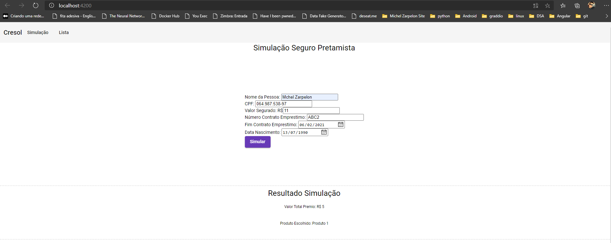
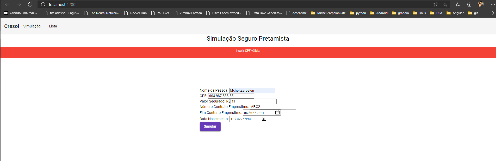
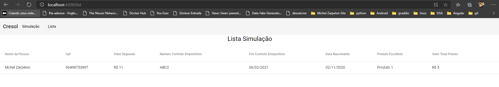

# AppSimulacao
### Executar
1. Instalar Nodjs
2. npm install -g @angular/cli
3. git clone https://github.com/michelzarpe/app-simulacao.git
4. cd app-simulacao
5. ng serve --o
6. http://localhost:4200/

### Versão
1. node --version: v10.16.0
2. npm --version: 6.9.0
3. ng --version:
3.1 @angular-devkit/architect         0.1000.8
3.2 @angular-devkit/build-angular     0.1000.8
3.3 @angular-devkit/build-optimizer   0.1000.8
3.4 @angular-devkit/build-webpack     0.1000.8
3.5 @angular-devkit/core              10.0.8
3.6 @angular-devkit/schematics        10.0.8
3.7 @angular/cdk                      10.2.6
3.8 @angular/cli                      10.0.8
3.9 @angular/material                 10.2.6
3.10 @ngtools/webpack                  10.0.8
3.11 @schematics/angular               10.0.8
3.12 @schematics/update                0.1000.8
3.13 rxjs                              6.5.5
3.14 typescript                        3.9.7
3.15 webpack                           4.43.0

### Print 
#### Simulacao Funcionando:

#### Exemplo com Erro

#### Lista
